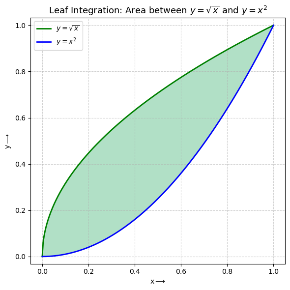

# Leaf-Integration

Leaf Integration: Area between $y=\sqrt{x}$ and $y=x^2$

## Overview

This project calculates and visualizes the area between two curves: $y = \sqrt{x}$ and $y = x^2$. The region bounded by these curves resembles a leaf shape, hence the name "Leaf Integration." The visualization demonstrates a classic calculus problem of finding the area between two functions using definite integration.

The curves intersect at two points: $(0, 0)$ and $(1, 1)$. Between these points, $\sqrt{x}$ lies above $x^2$, creating the characteristic leaf-shaped region.

## Math Background

### Finding the Intersection Points

To find where the curves intersect, we solve:
$$\sqrt{x} = x^2$$

Squaring both sides:
$$x = x^4$$
$$x^4 - x = 0$$
$$x(x^3 - 1) = 0$$

This gives us $x = 0$ or $x = 1$.

### Calculating the Area

The area between the curves is given by:
$$A = \int_{0}^{1} (\sqrt{x} - x^2) \, dx$$

Evaluating the integral:
$$A = \int_{0}^{1} x^{1/2} \, dx - \int_{0}^{1} x^2 \, dx$$

$$A = \left[\frac{x^{3/2}}{3/2}\right]_{0}^{1} - \left[\frac{x^3}{3}\right]_{0}^{1}$$

$$A = \left[\frac{2x^{3/2}}{3}\right]_{0}^{1} - \left[\frac{x^3}{3}\right]_{0}^{1}$$

$$A = \frac{2}{3} - \frac{1}{3} = \frac{1}{3}$$

**Result:** The area of the leaf-shaped region is exactly **1/3 square units**.

## Dependencies

This project requires the following Python libraries:

- **NumPy** – For numerical computations and array operations  
- **Matplotlib** – For creating visualizations and plotting graphs  

> **Note:** If you are using Anaconda, these libraries are already included, so no additional installation is required.


## Installation

Follow these steps to set up and run the project:

### Prerequisites
- Python 3.7 or higher

### Install Required Packages (if not using Anaconda)

Install the required packages using pip:
```bash
pip install numpy matplotlib
```

### Setup

1. Clone this repository:
   ```bash
   git clone https://github.com/0PKunal/Leaf-Integration.git
   ```

2. Then change the directory:
   ```bash
   cd Leaf-Integration
   ```

### Usage

Run the Python script to visualize the leaf-shaped area:

```bash
python Leaf_Integration.py
```

The script will:
- Calculate the area between the curves numerically
- Generate a visualization showing both curves and the shaded region
- Display the plot in a window

### What the Script Does

When you run `Leaf_Integration.py`, it:
1. Creates 250 evenly-spaced points between x=0 and x=1
2. Calculates y-values for both curves: $y = \sqrt{x}$ and $y = x^2$
3. Plots both curves with the upper curve in green and lower curve in blue
4. Fills the area between the curves with a semi-transparent green color
5. Displays a window with the complete visualization

## Output Preview

The program generates a visualization showing:
- The curve $y = \sqrt{x}$ (shown in green)
- The curve $y = x^2$ (shown in blue)
- The shaded leaf-shaped region between them (filled with semi-transparent green)
- Grid lines for reference
- Proper axis labels and legend

<p align="center">
  
</p>

<p align="center">
  <em>Visualization of the area between y=√x and y=x²</em>
</p>

**Mathematical Note:** This problem beautifully demonstrates how integration can compute areas of complex shapes. The result of exactly 1/3 is a precise mathematical fact, showcasing the elegance of calculus in solving geometric problems.

## File Descriptions

### Main Files

- **`Leaf_Integration.py`** - The main Python script that creates the visualization. It uses NumPy to generate data points and Matplotlib to plot the curves and fill the area between them.

- **`Leaf_Integration.png`** - A screenshot of the output visualization showing the leaf-shaped region between the two curves.

- **`LICENSE`** - MIT License file containing the terms of use for this project.

- **`README.md`** - This file, containing project documentation and instructions.

## License

This project is open source and available under the [MIT License](LICENSE).

**MIT License** - Copyright (c) 2025 0PKunal

Permission is hereby granted, free of charge, to any person obtaining a copy of this software and associated documentation files (the "Software"), to deal in the Software without restriction, including without limitation the rights to use, copy, modify, merge, publish, distribute, sublicense, and/or sell copies of the Software, and to permit persons to whom the Software is furnished to do so, subject to the following conditions outlined in the [LICENSE](LICENSE) file.
---
> **Note:** This README.md file was generated with the assistance of GitHub Copilot. While every effort has been made to ensure accuracy and clarity, there may still be minor errors or inconsistencies. Users are encouraged to review the content carefully and make any necessary adjustments.
---
<div align="center">
  <p>Made with ❤️ by <a href="https://github.com/0PKunal">0PKunal</a></p>
  <p>If this project helped you, please give it a ⭐️</p>
</div>
